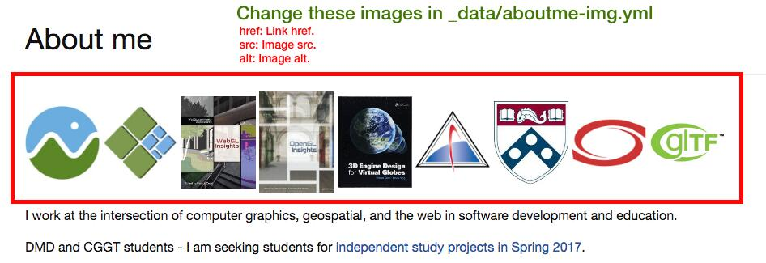
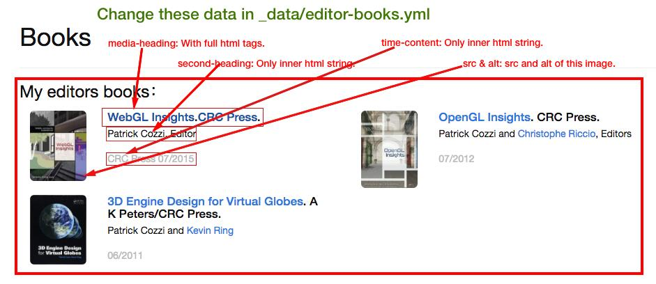
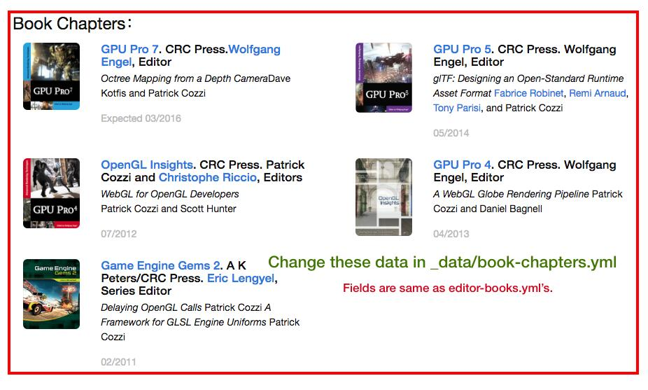
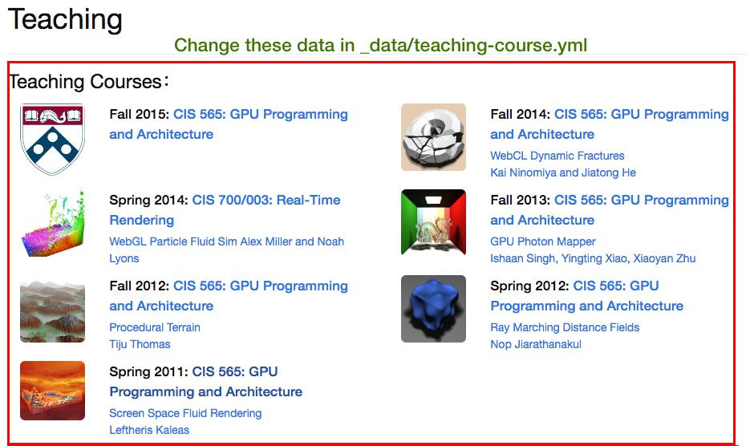
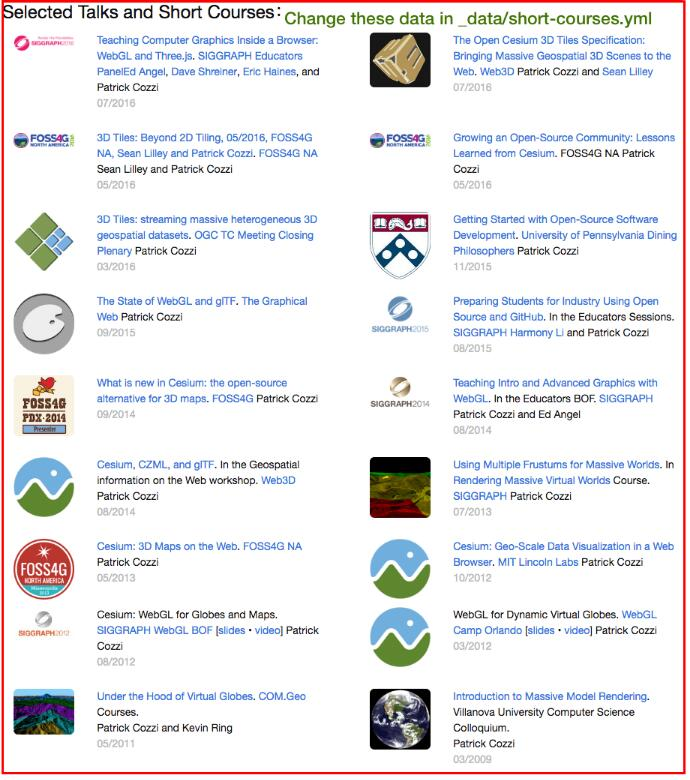
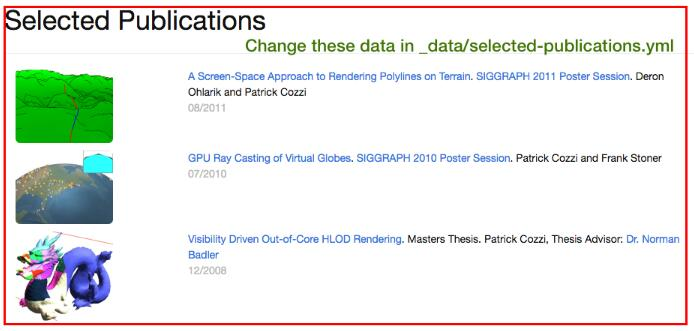
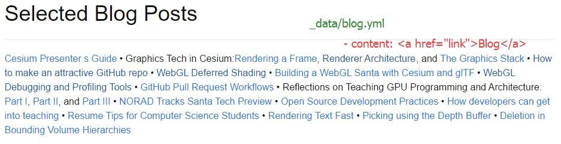
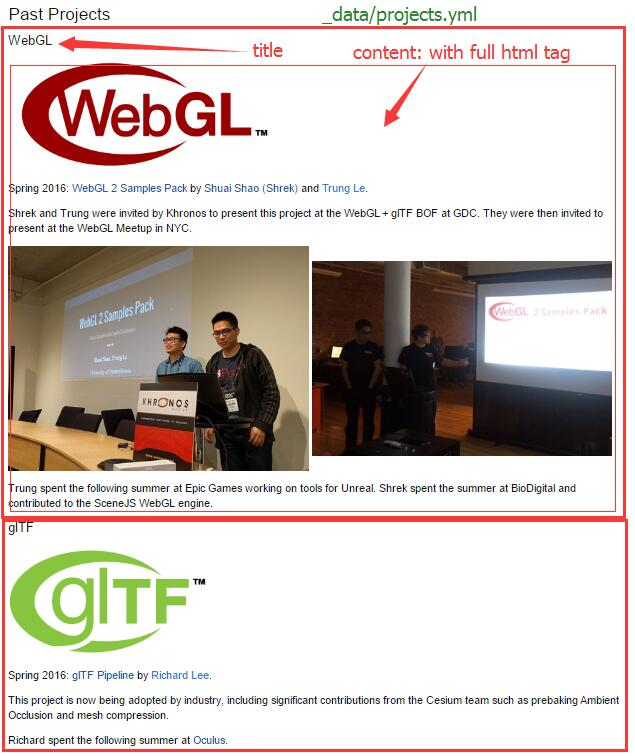

https://pjcozzi.github.io

https://www.seas.upenn.edu/~pcozzi/

Personal website for projects, books, talks, courses taught, etc.

## First time setup

This is powered by `Jekyll`. You need some installing to make it ready on your machine.
Basically: 

* Ruby
* RubyGems
* NodeJS
* Python 2.7

Follow [Jekyll Installation Instructions](https://jekyllrb.com/docs/installation/), then run

```
gem install bundler
```

After `Jekyll` is properly installed, `cd` to this project root, and do

```
bundle install
```

This functions like `npm install`


## Build sites locally

```
jekyll build
```
Or
```
jekyll build --watch
```

This will generate the site locally in `_site` folder.

To preview your site locally:
```
cd _site
python -m SimpleHTTPServer
``` 

## Deploy on github page (https://pjcozzi.github.io)

Simply pushing your changes to the github repo will automatically build the site and make it 
available on the internet. You don't even need to build site locally.

## Deploy on school server (https://www.seas.upenn.edu/~pcozzi/)

Build the site, and then put everything in `_site` folder to the school server. 

An alternative way is to direct this domain to the github page, so that you don't have to 
maintain two sites. Click this link for details: [Using a custom domain with GitHub Pages](https://help.github.com/articles/using-a-custom-domain-with-github-pages/)


## Update

Don't forget to build your sites after any updates. 

### Image

You can put images are in `img` folder. They will be automatically copied to `_site` when built. 

Also feel free to use external link for your images.

### Content

Content data are all in `_data` folder. You can find a `.yml` file for each section. 

Simply copy paste and modify will add a new item to that section. 

You can find what elements each attributes refer to in the image below. 

- `index.html`









- `projects.html`


